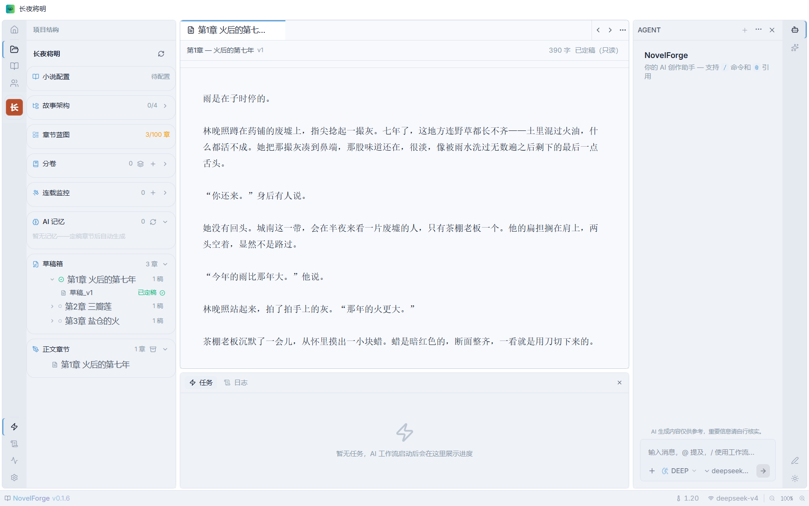
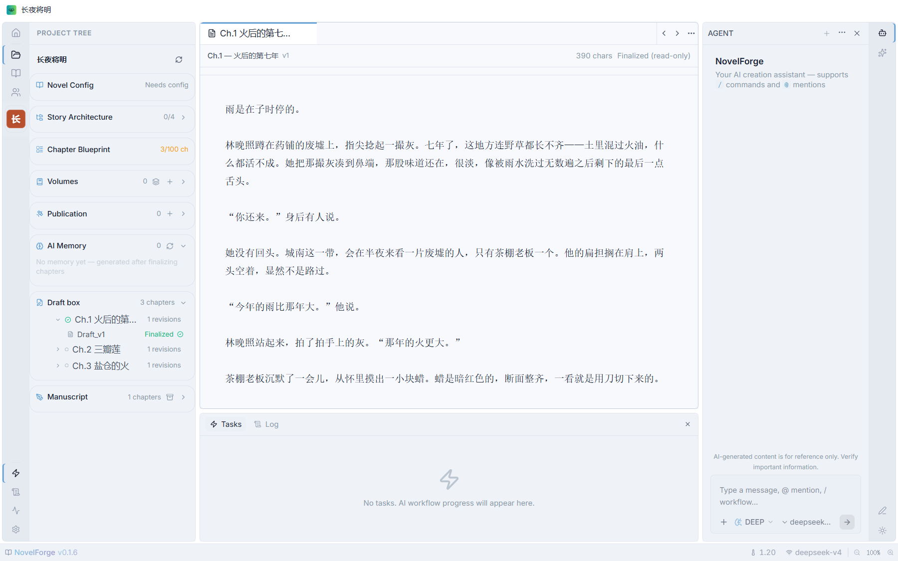
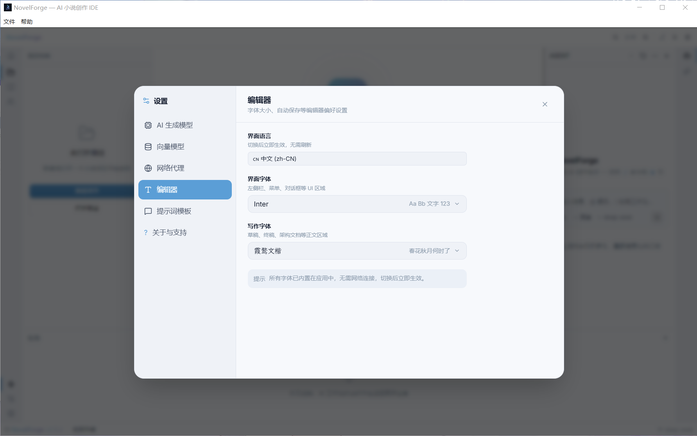
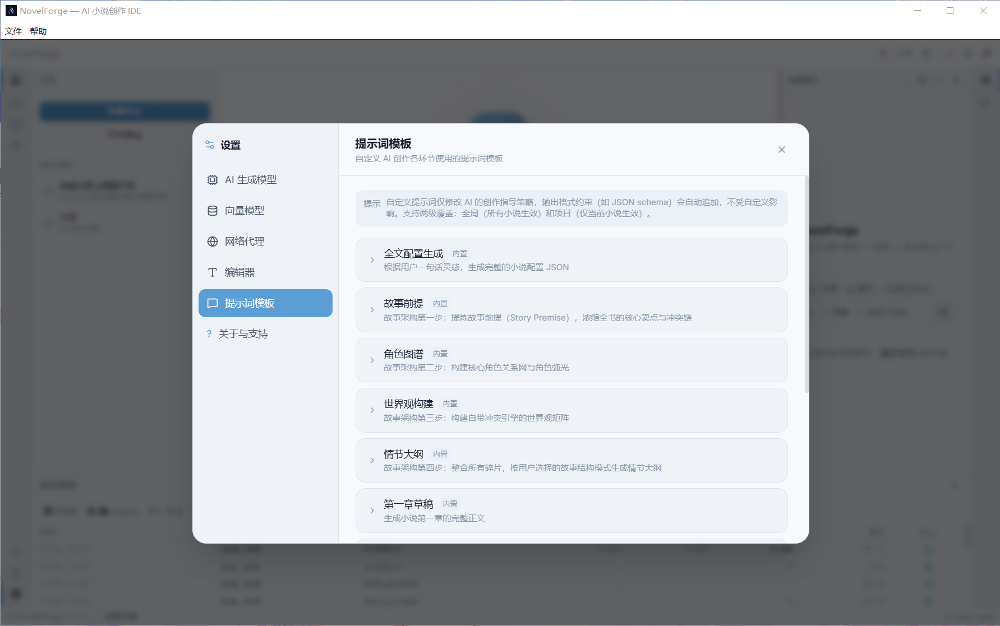

<div align="center">

# 🔥 NovelForge — AI Novel Writing IDE

**An AI-powered integrated development environment built for web novel authors.**

[](https://reactjs.org/)
[](https://www.electronjs.org/)
[](https://www.typescriptlang.org/)
[]()
[](https://github.com/LunaRime/novelforge/actions/workflows/build.yml)
[](https://opensource.org/licenses/GPL-3.0)

[🇬🇧 English] &nbsp; [🇨🇳 中文](README.md)

</div>

---

> **NovelForge** is an open-source, privacy-first AI writing IDE. It deeply integrates LLM-driven full workflows with a local RAG knowledge base, delivering an IDE-grade immersive writing experience. Supports **zh-CN / en-US / ru-RU** trilingual interface.

---

### 🔔 Important Note on Versioning

> Starting from v2.5.2, NovelForge has officially entered the **0.y.z early development phase**. This is not a "regression" — it's an honest signal to the community about where the project stands:
>
> - LLM output quality and UI interactions are still being actively tuned
> - Core APIs and workflows have not yet stabilized; breaking changes may occur
> - Each `0.x.x` release is one small step toward the goal: "making AI write satisfying fiction"
>
> We welcome you to join as an **early tester** — the more feedback we get, the faster the project matures.

---

## 📸 Screenshots

| Main Editor (Chinese) | Main Editor (English) |
|-----------------------|----------------------|
|  |  |

| Settings | Prompt Library |
|----------|---------------|
|  |  |

---

## Why NovelForge?

Writing a web novel is not just about typing words — it's about managing a complex system of characters, plot threads, worldbuilding rules, and chapter-level pacing across hundreds of chapters. Traditional writing tools treat this like a text document. NovelForge treats it like a software project.

| Pain Point | NovelForge Solution |
|------------|---------------------|
| Losing track of characters across 100+ chapters | Character cards with cross-chapter dynamic tracking + voice consistency analysis |
| Forgetting foreshadowing planted 50 chapters ago | Automatic foreshadowing scanner + resolution detector |
| Spending $200+/month on AI API calls | Tiered model routing saves 50-70% + prompt caching cuts input costs by 50% |
| Copy-pasting context between AI chat and editor | AI agent directly reads/writes your project — context is automatic |
| No way to compare draft versions | Multi-draft parallel generation with AI auto-scoring |
| Privacy concerns with cloud writing tools | 100% local storage: SQLite + LanceDB, works offline |

## How It Works

```
┌─────────────────────────────────────────────────────┐
│                    NovelForge                        │
│                                                     │
│  📋 Blueprint → ✍️ Draft → 🔍 Review → ✨ Finalize   │
│       │            │           │           │         │
│       ▼            ▼           ▼           ▼         │
│  AI generates  AI writes  5 reviewers  Post-process  │
│  chapter plan  chapter    score draft   pipeline     │
│       │            │           │           │         │
│       └────────────┴───────────┴───────────┘         │
│                        │                             │
│                  📚 Local RAG                        │
│            (SQLite + LanceDB Vector)                 │
└─────────────────────────────────────────────────────┘
```

## ✨ Key Features

### 🧬 AI Writing Pipeline

| Feature | Description |
|---------|-------------|
| 🌍 World & Setting Management | Global worldbuilding, plot backbone, character profiles (cross-chapter dynamic tracking) |
| 📋 Auto Outline & Beats | AI generates structural skeleton → chapter beats → scene/emotion/pacing requirements |
| 📐 Auto Chapter Splitting | AI analyzes outline and suggests chapter count, volume structure, and climax positions |
| ✍️ Streaming Chapter Generation | Per-chapter streaming typewriter generation with precise context awareness |
| 🎬 Chapter Transition Engine | Extracts scene cards from previous 3 chapters and injects into prompts for continuity |
| 🔄 Paragraph-Level Rewriting | Expand / condense / style shift / conflict enhance / polish — five modes, no full rewrite |
| 📝 Editorial Board Review | 5-role parallel review (editor-in-chief / plot / prose / continuity / style) + weighted scoring |
| 🎤 Character Voice Consistency | Analyzes character dialogue style post-finalization, auto-injects for consistency |
| 📊 Multi-Draft Comparison | Parallel generation of multiple versions per chapter, AI auto-scoring |
| 🔮 Foreshadowing Manager | Auto-scans for new foreshadowing + detects resolution of existing threads |
| 🔁 Post-Process Pipeline | Ingest → plot extraction → character update → foreshadowing scan → voice analysis → style learning (DAG parallel) |
| 🌐 Multilingual Prompt Templates | Built-in templates in EN/RU (19 templates + system constraints + system roles), AI output language follows the UI language |

### 📊 Writing Activity Dashboard

| Feature | Description |
|---------|-------------|
| 🔥 Daily Activity Heatmap | GitHub Contribution-style full-year view, hover for per-day writing/revision/calls/cost |
| 📅 Monthly Trend Chart | 12-month writing trend with year switching for history |
| 💰 Global Statistics | Cross-project aggregation of written words / revisions / model calls / tokens / cost |

### 🔍 Observability

| Feature | Description |
|---------|-------------|
| 📝 Dual-Environment Logs | Dev (DEBUG full) vs release (INFO+) separate directories; renderer logs persisted + global error capture |
| 🧩 LLM Extraction Logs | Call/JSON-parse/self-check retry fully visible, full diagnostics on parse failure |
| 💾 Save Feedback | Toast feedback for every save operation + modular logs (Save:{Module}) |

### 🧠 Million-Word Local Knowledge Base + Vector Engine

| Feature | Description |
|---------|-------------|
| 🔍 LLM + Vector Hybrid Retrieval | Semantic search + full-text search, auto-injected into AI prompts |
| 🧬 LLM-as-Vectorization | Use your LLM as the embedding model — no dedicated embedding API needed |
| 📊 IVF_PQ Vector Index | LanceDB ANN index for large-scale vector search acceleration |
| 🔒 100% Local Storage | SQLite + LanceDB, works offline |

### 💰 Cost Optimization Engine

| Feature | Description |
|---------|-------------|
| 🎯 Tiered Model Routing | elite / standard / budget — three tiers, saves 50-70% |
| ⚡ Prompt Caching | Automatic cache hits, cuts input costs by 50% |
| 📊 Real-Time Cost Tracking | Live session cost display in the status bar |
| 📐 Token Budget Engine | Intelligent truncation with system prompt size control |

### 🤖 AI Agent Assistant

| Feature | Description |
|---------|-------------|
| 🎯 Intent Pre-Routing | Zero-LLM local intent detection ("write chapter 3", "polish chapter 2") — strong hits trigger creative workflows directly, weak hits ask for clarification |
| 🌿 Conversation Branching | Fork a new session from any message / rewind with recovery, branch hierarchy in history panel |
| 📄 Tool Result Spill-to-Disk | Long tool results stored on disk with path + summary in context; LLM re-reads on demand (deterministic naming + dedupe) |
| 📐 Adaptive Context Compression | Budget scales with model window; recoverable errors auto-degrade and retry (withhold-then-recover) |

### 🛡️ Privacy & Security

| Feature | Description |
|---------|-------------|
| 🔒 Electron Sandbox | `sandbox: true` + IPC allowlist + path sandbox |
| 🔑 API Key Encryption | Electron safeStorage encrypted storage |
| 🔄 Exponential Backoff Retry | Auto-retry for 429/503/5xx + streaming retry |
| ✅ Database Integrity | SQLite PRAGMA checks + unified timestamps + CHECK constraints |

---

## 🚀 Installation

### 📦 Pre-built Releases (Recommended)

Download the latest from [Releases](https://github.com/LunaRime/novelforge/releases):
- **Windows**: `NovelForge-{version}-Installer.exe` (NSIS installer)
- **Windows**: `NovelForge-{version}-Portable.zip` (portable, extract and run)

### 🔨 Build from Source

#### Requirements

| Tool | Version | Notes |
|------|---------|-------|
| **Node.js** | `>= 22.x` | Matches Electron 41's bundled version |
| **pnpm** | `>= 9.x` | Package manager |
| **Python** | `>= 3.10` | Required to compile native modules (`better-sqlite3`, `lancedb`) |
| **C++ Toolchain** | — | Windows: Visual Studio Build Tools · macOS: Xcode CLT · Linux: `build-essential` |

#### Quick Start

```bash
# 1. Clone
git clone https://github.com/LunaRime/novelforge.git
cd novelforge

# 2. Install dependencies
pnpm install

# 3. Development mode (Vite HMR)
pnpm run dev

# 4. Type check
pnpm run typecheck

# 5. Run tests
pnpm run test

# 6. Full build
npm_config_user_agent="pnpm/9.15.4" \
CSC_IDENTITY_AUTO_DISCOVERY=false \
ELECTRON_BUILDER_BINARIES_MIRROR="https://npmmirror.com/mirrors/electron-builder-binaries/" \
pnpm run build
```

> **Build environment variables**:
> - `npm_config_user_agent` — Forces electron-builder to detect pnpm
> - `CSC_IDENTITY_AUTO_DISCOVERY=false` — Skips code signing (not needed for local builds)
> - `ELECTRON_BUILDER_BINARIES_MIRROR` — Mirror for faster downloads (essential in China; optional elsewhere)
>
> Build output is organized by release type at `release/{type}/{version}/` (`alpha` internal / `beta` public / `stable` release):
> - `NovelForge-{version}-Portable/` — Portable edition (`.7z` archive auto-generated for beta/stable)
> - `NovelForge-{version}-Installer/NovelForge-{version}-Installer.exe` — NSIS installer
> - `latest.yml` / `.blockmap` — electron-updater metadata

#### Windows Build Issues

| Issue | Solution |
|-------|----------|
| winCodeSign 7z symlink download failure | Manually extract to `%LOCALAPPDATA%/electron-builder/Cache/winCodeSign/` |
| NSIS 7z symlink download failure | Extract to `%LOCALAPPDATA%/electron-builder/Cache/nsis/` |
| pnpm not detected | Set `npm_config_user_agent=pnpm/9.15.4` |
| GitHub download timeout | Set `ELECTRON_BUILDER_BINARIES_MIRROR` mirror |

#### Native Modules

The project depends on two native modules: `better-sqlite3` and `@lancedb/lancedb`.

```bash
# Rebuild native modules for Electron's bundled Node version
pnpm run rebuild
```

---

## ⚙️ Model Configuration

Supports `OpenAI` · `DeepSeek` · `Gemini` · `Claude` · `Ollama` · `Zhipu GLM` · any OpenAI-compatible API.

Configure your AI generation model and vector model in Settings. Enable tiered routing and prompt caching to save costs.

---

## 🏗️ Tech Stack

| Layer | Technology |
|-------|-----------|
| Frontend | React 19 + TypeScript + Zustand + Tailwind CSS + Radix UI |
| Desktop | Electron 41 + Vite 8 |
| Data | better-sqlite3 (relational) + LanceDB (vector) |
| AI | OpenAI Protocol + Gemini Protocol + MCP + ReAct Agent |
| Testing | Vitest + Storybook |
| CI/CD | GitHub Actions (ubuntu / windows / macos matrix) |

---

## 📄 License

GPL-3.0 open source. Originally forked from [Vela](https://github.com/heider-x/vela) by heider-x, maintained and developed by LunaRime.

---

<div align="center">
<b>NovelForge — Forge your novel with AI.</b>
</div>
