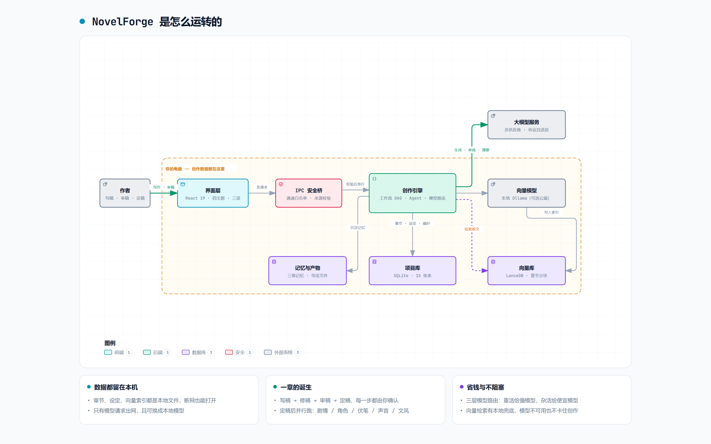
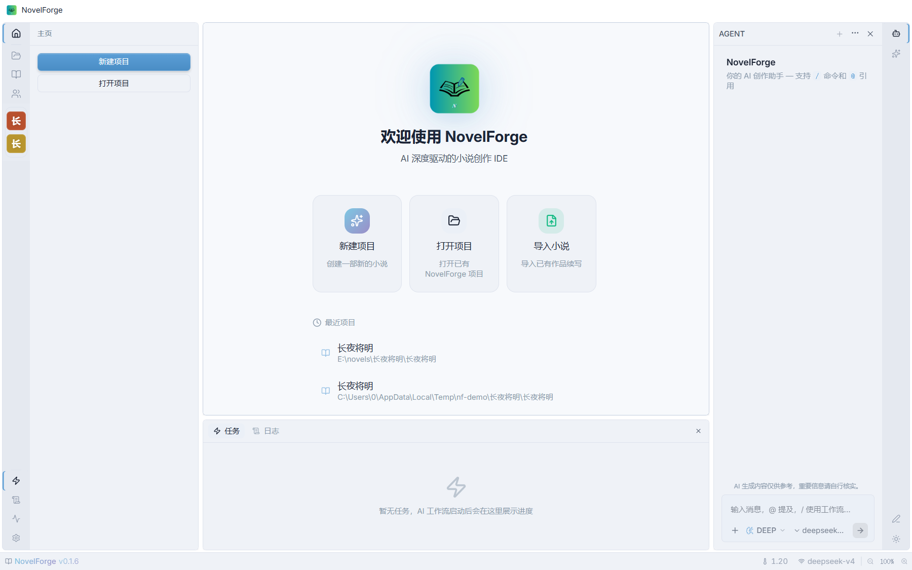
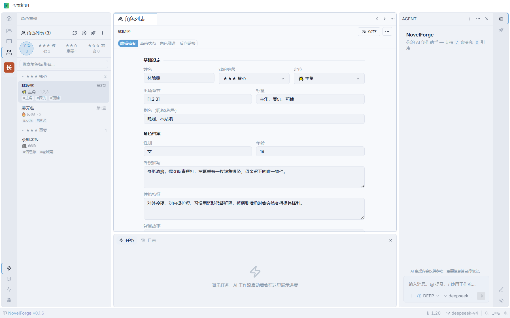
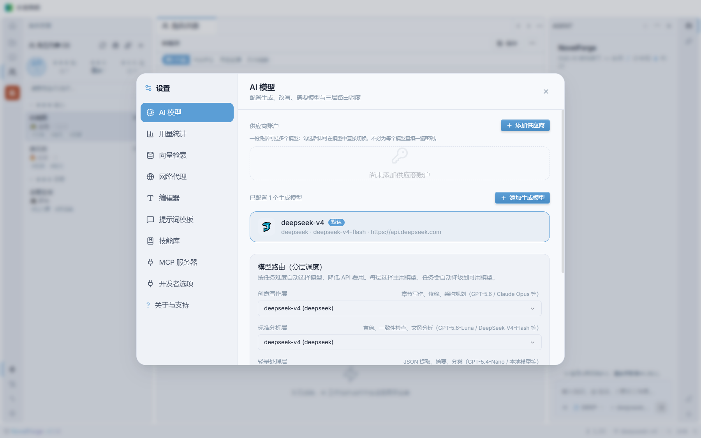
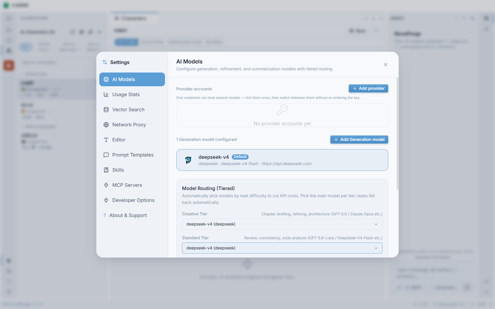

<div align="center">

# 🔥 NovelForge — AI 小说创作 IDE

**AI 深度驱动的小说创作集成开发环境，为网文作者而生。**

[](https://reactjs.org/)
[](https://www.electronjs.org/)
[](https://www.typescriptlang.org/)
[]()
[](https://github.com/LunaRime/novelforge/actions/workflows/build.yml)
[](https://opensource.org/licenses/GPL-3.0)

[🇨🇳 中文] &nbsp; [🇬🇧 English](README.en.md)

</div>

---

> **NovelForge** 是一款开源、隐私优先的 AI 写作 IDE。将大语言模型驱动的全流程工作流与本地 RAG 知识库深度融合，为作者提供 IDE 级别的沉浸式创作体验。支持 **zh-CN / en-US / ru-RU** 三语界面。

---


---

## 🗺️ 它是怎么运转的



> 作者 → 界面层 → IPC 安全桥 → 创作引擎 → 模型服务；**章节、设定、向量索引全部留在本机**，只有模型请求出网。
> 图由 [archify](https://github.com/tt-a1i/archify) 从 `docs/diagrams/novelforge-architecture.zh.json` 生成（英文版见 [README.en.md](README.en.md)）。

## 📸 界面截图

| 主编辑界面（中文） | 主编辑界面（英文） |
|-------------------|-------------------|
|  |  |

| 欢迎页 | 角色管理 |
|----------|-----------|
|  |  |

| 模型与供应商配置（中文） | 设置界面（英文） |
|----------|-----------|
|  |  |

---

## ✨ 核心特性

### 🧬 AI 小说创作全流程

| 能力 | 说明 |
|---|---|
| 世界观与设定管理 | 全局世界观、剧情主轴、角色人设档案（跨章动态追踪） |
| 自动大纲与细纲生成 | AI 生成结构骨架 → 章节细纲 → 场景/情绪/节奏要求 |
| 大纲自动拆章 | AI 分析大纲自动建议章节数、分卷结构和高潮章号 |
| 流式章节正文生成 | 单章流式打字机生成，精准响应前文上下文 |
| 章节过渡引擎 | 写稿前提取前3章场景卡片注入 prompt，确保连贯性 |
| 段落级改写 | 扩写/缩写/改风格/增强冲突/润色五种模式，非全文重写 |
| 编辑部协作审阅 | 5 角色并行评审（主编/情节/文案/连续性/风格）+ 加权评分 |
| 角色声音一致性 | 定稿后分析角色对话风格，写稿时自动注入保持一致性 |
| 多稿对比择优 | 同章并行生成多版本，AI 自动评分选出最佳 |
| 伏笔管理器 | 自动扫描新伏笔 + 检测回收旧伏笔，防止遗忘 |
| 后期管线 | 正文入库 → 剧情提取 → 角色更新 → 伏笔扫描 → 声音分析 → 文风学习（DAG 并行） |
| 撤销/重做 | Ctrl+Z/Y 快捷键 + 工具栏按钮，CodeMirror 6 原生支持 |
| 多语言 Prompt 模板 | 内置模板英/俄双语（19 模板 + 系统约束 + 角色定位），输出语言自动跟随界面语言 |

### 📊 写作数据看板

| 能力 | 说明 |
|---|---|
| 每日活动热力图 | GitHub Contribution 风格全年视图，悬停查看单日写作/修改/调用/费用 |
| 月度趋势柱状图 | 全年 12 个月写作趋势，年份切换查看往期 |
| 全局统计 | 跨项目聚合写作字数 / 修改量 / 模型调用 / Tokens / 费用 |

### 🔍 可观测性

| 能力 | 说明 |
|---|---|
| 双环境日志流 | 开发（DEBUG 全量）与发布（INFO 起）分目录；渲染进程日志落盘 + 全局错误捕获 |
| LLM 提取日志 | 调用/JSON 解析/自检重试全过程可见，解析失败完整诊断落盘 |
| 保存行为反馈 | 所有保存操作 toast 视觉反馈 + 模块化日志（Save:{Module}） |

### 🧠 百万字级本地知识库 + 向量引擎

| 能力 | 说明 |
|---|---|
| LLM+向量融合检索 | 语义搜索 + 全文检索混合，自动注入 AI prompt |
| LLM 向量化 | 将 LLM 作为向量模型使用，无需专用 Embedding API |
| 本地向量模型 | 可接本地 Ollama（bge-m3 等），无网也能语义检索；四级降级链 本地 ⇄ 云端 API → LLM → 全文检索 |
| 中文检索 | jieba 分词 + FTS 全文索引，中文检索不再退化为整句匹配 |
| IVF_PQ 向量索引 | LanceDB ANN 索引加速大规模向量检索 |
| 纯本地存储 | SQLite + LanceDB，断网可用 |

### 💭 AI 记忆（作品记忆）

| 能力 | 说明 |
|---|---|
| 三级摘要 | 定稿即生成章节记忆 → 卷内章节齐全后聚合卷记忆 → 每满 3 卷重建全书状态 |
| 跨会话事实 | 会话压缩时顺带提取「可复用事实」，下次对话自动带上，不额外花钱 |
| 失效与重建 | 改分卷边界、重定稿会把受影响的记忆标记为「待重建」，陈旧记忆不再进上下文 |
| 可查可改 | 侧栏「AI 记忆」组可查看 / 编辑 / 删除，卷与全书支持手动重建 |

### 💰 成本优化引擎

| 能力 | 说明 |
|---|---|
| 分层模型路由 | elite/standard/budget 三层自动路由，节省 50-70% |
| Prompt 缓存 | API 自动缓存命中，输入费用降低 50% |
| 实时费用追踪 | StatusBar 实时显示会话费用 |
| Token 预算引擎 | 智能截断，系统提示词上限控制 |

### 🤖 AI Agent 助手

| 能力 | 说明 |
|---|---|
| 意图预路由 | 本地零 LLM 成本识别「写第三章」「润色第2章」等意图，强命中直接触发创作工作流、弱命中澄清追问 |
| 对话分支 | 任意消息 fork 派生新会话 / rewind 回退可恢复，历史面板分支层级标注 |
| 工具结果写盘引用 | 长工具结果全文落盘按需再读，上下文只进路径 + 摘要（确定性命名 + 写盘防重） |
| 自适应上下文压缩 | 压缩预算按模型窗口动态化，可恢复错误自动降档重试（withhold-then-recover） |
| 工具与技能 | 23 个内置工具（读写/检索/编辑/工作流）+ SKILL.md 技能包（内置 / 用户 / 项目三级，兼容 Cursor 生态） |
| MCP | 接入任意 MCP 服务器扩展工具面 |
| 上下文可视化 | 占用圆环 + 明细弹层（基础 / 记忆 / 历史 / 当前），费用与缓存命中率实时可见 |

### 🛡️ 安全加固

| 能力 | 说明 |
|---|---|
| Electron 沙箱 | `sandbox: true` + IPC 通道白名单 + 路径沙箱 |
| API 密钥加密 | Electron safeStorage 加密存储 |
| LLM 指数退避重试 | 429/503/5xx 自动重试 + 流式重试 |
| 数据库完整性 | SQLite PRAGMA 检查 + 时间字段统一 + CHECK 约束 |

---

## 🚀 安装

### 📦 预构建版本（推荐）

前往 [Releases](https://github.com/LunaRime/novelforge/releases) 下载最新安装包：
- **Windows**: `NovelForge-{version}-Installer.exe`（NSIS 安装程序）
- **Windows**: `NovelForge-{version}-Portable.zip`（绿色便携版，解压即用）

### 🔨 源码构建

#### 环境要求

| 工具 | 版本 | 说明 |
|------|------|------|
| **Node.js** | `>= 22.x` | Electron 41 内置版本 |
| **pnpm** | `>= 9.x` | 包管理器（项目使用 pnpm workspace） |
| **Python** | `>= 3.10` | 编译 `better-sqlite3` / `lancedb` 等原生模块 |
| **C++ 工具链** | — | Windows: Visual Studio Build Tools · macOS: Xcode CLT · Linux: `build-essential` |

#### 快速开始

```bash
# 1. 克隆仓库
git clone https://github.com/LunaRime/novelforge.git
cd novelforge

# 2. 安装依赖（使用 pnpm）
pnpm install

# 3. 开发模式（Vite HMR 热更新）
pnpm run dev

# 4. 类型检查
pnpm run typecheck

# 5. 运行测试
pnpm run test

# 6. 完整构建（Windows 下需设置镜像环境变量加速下载）
npm_config_user_agent="pnpm/9.15.4" \
CSC_IDENTITY_AUTO_DISCOVERY=false \
ELECTRON_BUILDER_BINARIES_MIRROR="https://npmmirror.com/mirrors/electron-builder-binaries/" \
pnpm run build
```

> **构建环境变量说明**：
> - `npm_config_user_agent` — 强制 electron-builder 识别 pnpm 包管理器
> - `CSC_IDENTITY_AUTO_DISCOVERY=false` — 跳过代码签名（本地构建无需证书）
> - `ELECTRON_BUILDER_BINARIES_MIRROR` — npmmirror 镜像加速（国内网络必需，避免 GitHub 下载超时）
>
> 构建产物按版本类型归位到 `release/{type}/{version}/`（`alpha` 内测 / `beta` 公测 / `stable` 正式版）：
> - `NovelForge-{version}-Portable/` — 绿色便携版（beta/stable 自动附带 `.7z` 压缩包）
> - `NovelForge-{version}-Installer/NovelForge-{version}-Installer.exe` — NSIS 安装程序
> - `latest.yml` / `.blockmap` — electron-updater 自动更新元数据

#### 构建卡点（Windows）

| 卡点 | 解决方案 |
|------|---------|
| winCodeSign 7z symlink 下载失败 | 手动下载解压到 `%LOCALAPPDATA%/electron-builder/Cache/winCodeSign/` |
| NSIS 7z symlink 下载失败 | 同上，解压到 `%LOCALAPPDATA%/electron-builder/Cache/nsis/` |
| pnpm 包管理器未检测 | 设置 `npm_config_user_agent=pnpm/9.15.4` |
| GitHub 下载慢/超时 | 设置 `ELECTRON_BUILDER_BINARIES_MIRROR` 镜像 |

#### 原生模块说明

项目依赖 `better-sqlite3` 和 `@lancedb/lancedb` 两个原生模块：

```bash
# 针对 Electron 内置 Node 版本重新编译原生模块
pnpm run rebuild
```

---

## ⚙️ 模型配置

支持 `OpenAI` · `DeepSeek` · `Gemini` · `Claude` · `Ollama` · `智谱 GLM` · 任何 OpenAI 兼容 API。

- **供应商账户**：一份凭据挂多个模型 —— 添加供应商后**自动拉取其可用模型列表**，勾选即可用，切换模型不用重新填密钥
- **分层路由**：三代三层（创意写作 / 标准分析 / 轻量处理）各自指定模型，省钱且不牺牲质量
- **本地向量模型**：可在应用内一键下载（多路径自动测速选路 + 断点续传 + 慢时自动换路）

---

## 🏗️ 技术架构

| 层 | 技术栈 |
|----|--------|
| 前端 | React 19 + TypeScript + Zustand + Tailwind CSS + Radix UI |
| 桌面 | Electron 41 + Vite 8 |
| 数据 | better-sqlite3 (关系型) + LanceDB (向量) |
| AI | OpenAI Protocol + Gemini Protocol + MCP + ReAct Agent |
| 测试 | Vitest + Storybook |
| CI/CD | GitHub Actions (ubuntu/windows/macos 矩阵) |

---

## 📄 协议

基于 GPL-3.0 开源。原始项目 [Vela](https://github.com/heider-x/vela) by heider-x，由 LunaRime 持续开发维护。

---

<div align="center">
<b>NovelForge — Forge your novel with AI.</b>
</div>
